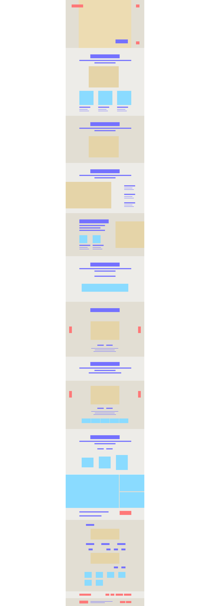

###### Practice #1

# Gear VR

삼성의 갤럭시 브랜드 사이트에서 제공하는 Gear VR의 소개 페이지를 나름의 기준을 세워 직접 개발해보았다. 개발은 다음과 같은 순서로 진행하였다. 

- 1. 기존 사이트 분석
- 1. 개발 계획 수립
- 1. 마크업
- 1. 스타일링
- 1. 자바스크립트 기능 구현
- 1. 성능 최적화
- 1. 깃헙페이지로 배포

---

## 1. 기존 사이트 분석

기존 페이지가 가지는 주요 기술적 특징은 다음과 같았다. 고퀄리티의 이미지를 활용하여 스크롤 위치에 따라 효과가 적용된 패럴렉스 페이지로 구현되었고, 요소들에는 디테일한 모션 효과가 적용되어 사용자의 시선을 사로잡았다. 더불어 반응형으로 제작되어 모바일/태블릿에서도 콘텐츠를 소비할 수 있었다.

- 반응형 웹디자인
- 패럴렉스 스크롤
- 요소들의 모션 효과
 

---

## 2. 개발 계획 수립

해당 사이트의 주요 특징을 구현하기 위해 개발에 앞서 아래와 같은 작업 기준을 세웠다.

- 소스는 기존 사이트는 기존 사이트 소스를 내려받아 활용한다.
- 단 기존 사이트에서 사용된 폰트인 Sharp sans는 라이센스 문제로 Futura 등 유사한 스타일을 가진 폰트로 대체한다.
- IE 9까지만 고려하여 작업한다.
- 패럴렉스 구현을 위해 Scroll Magic 라이브러리를 활용한다.
- CSS Preprocessor로는 Sass를 사용하고, 업무 자동화 도구로 Gulp를 사용한다.
- jQuery의 사용없이 Dom Helper를 사용하여 작업하고, 애니메이션 구현을 위해는 TwinMax를 사용한다.
- 작업 목표 기한은 1.5일로 한다.

---

## 3. 마크업

### 3-1. 초기 세팅작업

- IE 호환성보기 모드 최신으로 설정
- 인코딩 설정
- 뷰포트 설정 
- SEO 코드 작성 (+오픈그래프)

### 3.2 구조화 작업

기존 Gear VR 페이지를 구조화하기 위한 사전 작업으로 와이어프레임을 구성해보았다. 와이어프레임은 섹션, 배경 이미지, 요소, 버튼의 몇 가지로 단순화하여 구조화하였고, 이를 바탕으로 실제 마크업을 진행했다.

---

## 4. 스타일링

## 5. 자바스크립트 기능 구현

## 6. 성능 최적화

## 7. 후기

